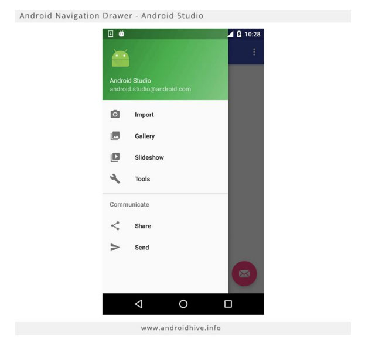

# Desenvolvimento-de-Interfaces-Android

Envie os projeto do Android Studio em Formato Zip com uma interface que mostre os dados Profissionais de uma Pessoa. Utilize o NavigationView, como o exemplo abaixo:

Ao clicar no “Ícone Hamburguer”, o menu lateral deverá exibir os seguintes itens:

Informações Pessoais
Formação
Experiência Profissional
Cursos
Publicações

Ao clicar em cada um desses itens, as respectivas informações devem ser exibidas na Tela Principal.

Exemplo: Ao clicar em informações pessoais, deverá ser exibido a foto do profissional, nome, idade, data de nascimento, estado civil, telefone. Utilize dados estáticos com suas próprias informações profissionais.
